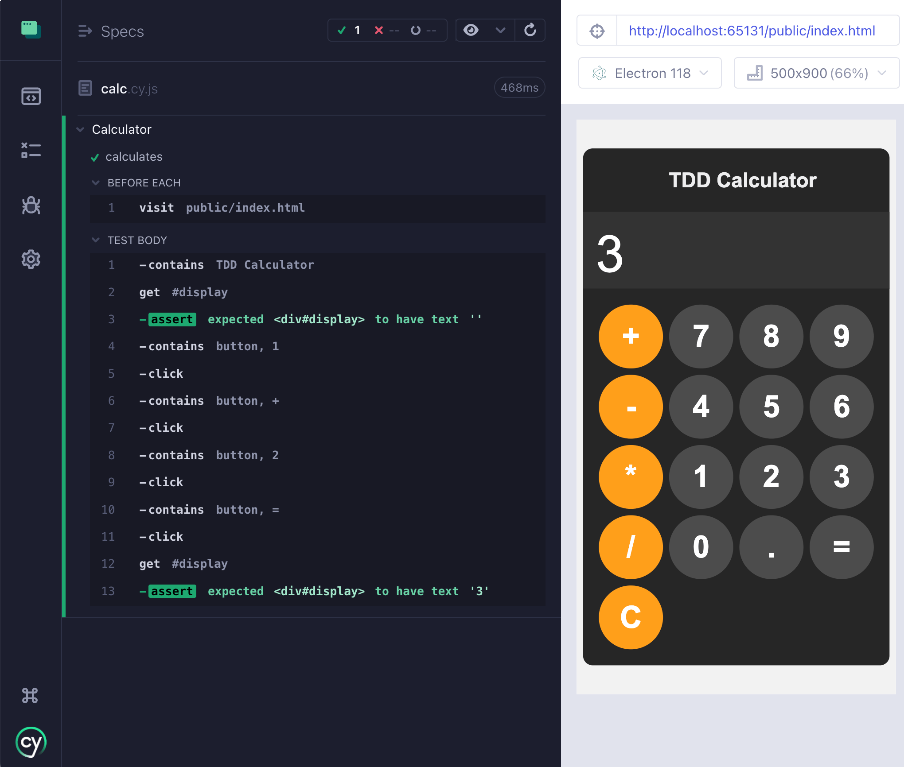

# tdd-calc

> Build a simple HTML calculator using test-driven development

🎓 This is the example application for the course [TDD Calculator](https://cypress.tips/courses/tdd-calculator).



## Lessons

Clone this repo to your local machine

```shell
$ git clone git@github.com:bahmutov/tdd-calc.git
# git clones the repo into "tdd-calc" folder
$ cd tdd-calc
```

The starting code for each lesson is located in a separate branch, like `a1`, `a2`, ... etc. A typical lesson would start with:

```
$ git checkout <branch name>
$ npm install
$ npx cypress open
```

Then follow the lesson prompts from [the course](https://cypress.tips/courses/tdd-calculator)
